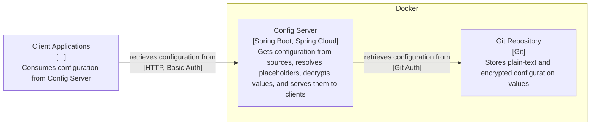

[](https://sonarcloud.io/summary/new_code?id=mihaly-farkas_spring-cloud-config-server)

# Spring Cloud Config Server

TODO: write a description

## 📦 Features

TODO: write the features in bullet points

## 🏗️ Architecture

TODO: write a few sentences about the architecture of the project, including the main components and their interactions.

### Components Diagram



## 🔧 Getting Started

### Prerequisites

- Git CLI
- Java JDK 25 or higher

- `dotenvx` _(optional)_
    - Installation (macOS): `brew install dotenvx/brew/dotenvx`

### Installation Steps

1. Clone the repository:

   ```bash
   git clone https://github.com/mihaly-farkas/spring-cloud-config-server
   cd spring-cloud-config-server
   ```

2. Set up environment variables by copying the example file and then updating the values:

   ```bash
   cp example/.env .env
   ```

   You must edit the `.env` file to set the appropriate values for your environment.

3. Start the Spring Boot application using Maven:

   ```bash
   ./mvnw clean verify spring-boot:run
   ```

   Do not forget to set the environment variables before running the application. For example, you can use the `dotenvx` tool to load the environment variables from the `.env` file:

   ```bash
   dotenvx run -- ./mvnw clean verify spring-boot:run
   ```


## 🚀 Usage

TODO: write it

## ⚖️ License

This project is licensed under the [MIT License](https://github.com/mihaly-farkas/spring-cloud-config-server?tab=MIT-1-ov-file).

## ⚠️ Disclaimer

This project is a personal hobby and is intended solely for experimental and educational purposes.

* **Provided "As-Is":** The code is provided without any express or implied warranty of any kind.
* **No Liability:** Use this software entirely at your own risk. The author accepts no liability for any damages, data loss, or system failures.
* **Production Use:** If you choose to deploy this in a production environment, you are solely responsible for auditing, testing, and verifying its suitability.
