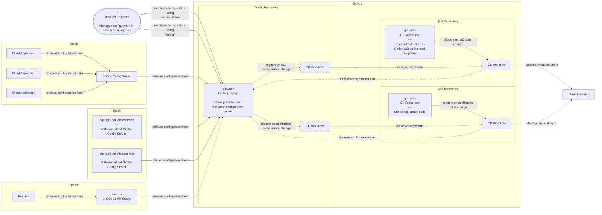

[](https://github.com/mihaly-farkas/gitops-config-server/actions/workflows/continuous-delivery.yml)
[](https://sonarcloud.io/summary/new_code?id=mihaly-farkas_gitops-config-server)
[](https://sonarcloud.io/summary/new_code?id=mihaly-farkas_gitops-config-server)
[](https://sonarcloud.io/summary/new_code?id=mihaly-farkas_gitops-config-server)
[](https://sonarcloud.io/summary/new_code?id=mihaly-farkas_gitops-config-server)
[](https://www.oracle.com/java/technologies/javase/jdk25-archive-downloads.html)
[](https://maven.apache.org/download.cgi)
[](https://spring.io/projects/spring-boot)
[](https://spring.io/projects/spring-cloud)
[](https://docs.docker.com/engine/reference/builder/)
[](https://opensource.org/licenses/MIT)

> _Stop maintaining configuration in five different places. Put it in Git._

# GitOps Config Server

A containerized configuration service for GitOps-style configuration management, built on top of [Spring&nbsp;Cloud&nbsp;Config&nbsp;Server](https://spring.io/projects/spring-cloud-config).

It treats a Git repository as the single source of truth for configuration and provides configuration to applications, deployment pipelines, infrastructure provisioning tools, and other consumers through a standard HTTP API.

The container can be executed from any Docker-compatible environment, making it easy to embed into any modern application architecture or deployment pipeline that can consume standard YAML or JSON configurations over HTTP.

## 💡 Motivation

In the spirit of **Infrastructure as Code** and the broader **Everything-as-Code** philosophy, this project extends that principle to **Configuration Management**.

Rather than managing environment properties through different platforms, manual dashboards, environment-specific copies, or scattered configuration files, this server enables you to:

- **Store all configuration as versioned files in a single Git repository** — your Single Source of Truth. You can manage configuration for applications, deployment pipelines, and infrastructure provisioning in one place, based on the same configuration models without copy-paste errors.

- **Decouple execution environments** by allowing runtime environments to quickly spin up their own Config Server instances without relying on a centrally hosted Config Server. The runtime environment only needs access to the Git repository, eliminating the Config Server as a centralized network dependency and single point of failure.

- **Use variable substitution and templating** via Spring Cloud Config's placeholder resolution to avoid configuration duplication across different applications, environments, and deployment pipelines.

- **Edit and review configuration changes** in your favorite IDE or Git interface, with the full power of version control, code review, and CI/CD pipelines.

This approach brings the benefits of code — versioning, reviewability, reusability, and automation — to the often-overlooked domain of configuration management. The goal is not to introduce another centralized configuration platform, but to make configuration delivery lightweight, reproducible, disposable, and Git-driven.

## 🚀 Quick Start

1. Run the container with the necessary environment variables. For example, to consume configuration from this project's [example config repo](https://github.com/mihaly-farkas/gitops-config-server-example) files, you can run:

   ```bash
    docker run \
    --name    gitops-config-server \
    --env     CONFIG_GIT_URI=https://github.com/mihaly-farkas/gitops-config-server-example \
    --env     CONFIG_ADMIN_PASSWORD="y0uR_S3cur3_aDm1N_P4ssw0rd" \
    --env     CONFIG_ENCRYPTION_KEY="3x4mp13_r3p0_S3cur3_3Nc1pT1on_k3Y" \
    --publish 8888:8888 \
    ghcr.io/mihaly-farkas/gitops-config-server:latest-beta
   ```
2. Access the configuration via HTTP:

   ```bash
   curl -su admin:y0uR_S3cur3_aDm1N_P4ssw0rd http://localhost:8888/config/gitops_config_server-example.json | jq .
   ```

3. Visit the Swagger UI for API exploration:

- **URL:** http://localhost:8888/swagger-ui/index.html?urls.primaryName=Spring+Cloud+Config
- **Username:** `admin`
- **Password:** `y0uR_S3cur3_aDm1N_P4ssw0rd`

## 📦 Features

- **Spring Cloud Config Compatible:** Built on Spring Cloud Config Server and compatible with the standard Spring Cloud Config client ecosystem, including application and profile-based configuration, labels, placeholder resolution, configuration overrides, and other standard Spring Cloud Config features.

- **Containerized Distribution:** Distributed as a Docker image with the required runtime configuration already assembled.

- **Ready-to-Use Configuration Setup:** Comes with the essential Spring Boot, Spring Cloud Config, security, encryption, and operational configuration already set up. No Spring configuration required. No security configuration required. No keystore setup required. Just provide the required settings through environment variables and start the container.

  - **Git Repository Backend:** Use a Git repository as the configuration backend with configurable repository, branch, credentials, and search paths.

  - **Configuration Encryption:** Encrypt and decrypt sensitive configuration values using Spring Cloud Config's built-in encryption support.

  - **Built-in Security:** Provides basic authentication for the configuration and management endpoints, with a configurable username and password.

  - **Health and Monitoring:** Provides Spring Boot Actuator endpoints.

  - **OpenAPI Documentation:** Provides API documentation for the exposed configuration and management endpoints.

## 🏗️ Architecture

The GitOps Config Server acts as an adapter between a Git-based configuration repository and the systems that consume configuration at runtime or during deployment.

It can run as a shared service, alongside an application stack, or as a temporary component inside a CI/CD pipeline. The deployment model is intentionally decoupled from the configuration source.

When a client requests configuration properties, the _GitOps Config Server_ fetches the configuration from the target Git repository, decrypts encrypted values, resolves dynamic placeholders, and transforms it into the requested format.

How you structure your own solution is entirely up to you. The diagram below illustrates a few possible setups, but the config server can be integrated into any architecture.



## ⚠️ Disclaimer & Liability

This project is an open-source initiative and is distributed under the terms of standard open-source compliance.

* **Provided "As-Is":** The software is provided without warranty of any kind, express or implied, including but not limited to the warranties of merchantability or fitness for a particular purpose.
* **No Liability:** In no event shall the authors or copyright holders be liable for any claim, damages, or other liability, whether in an action of contract, tort, or otherwise, arising from, out of, or in connection with the software.
* **Production Deployment:** While designed with modern architectural patterns, any deployment into target environments is done at your own discretion. Users are solely responsible for auditing, securing, and validating the system integration before use.

## ⚖️ License

This project is licensed under the [MIT License](https://github.com/mihaly-farkas/gitops-config-server?tab=MIT-1-ov-file).
